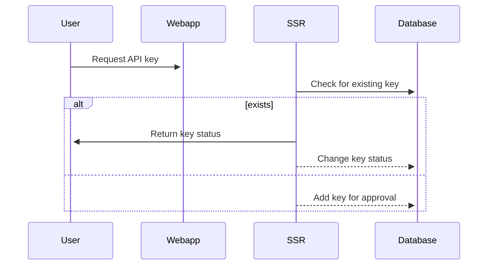
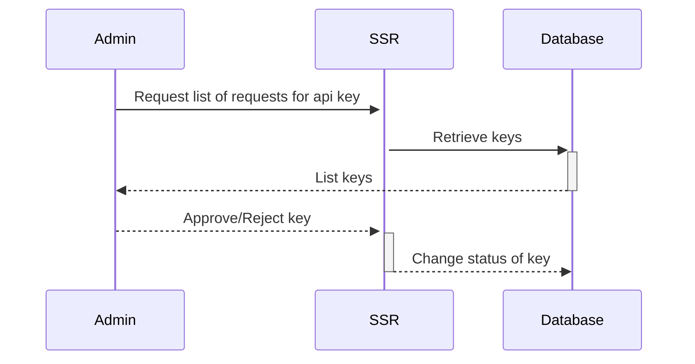

# This might not happen as it requires a lot of work
## Request to obtain API key which allows to use slots
Users can request API Key which allow to use slots from platform on their own website.

## Admin approves/rejects request for API key

