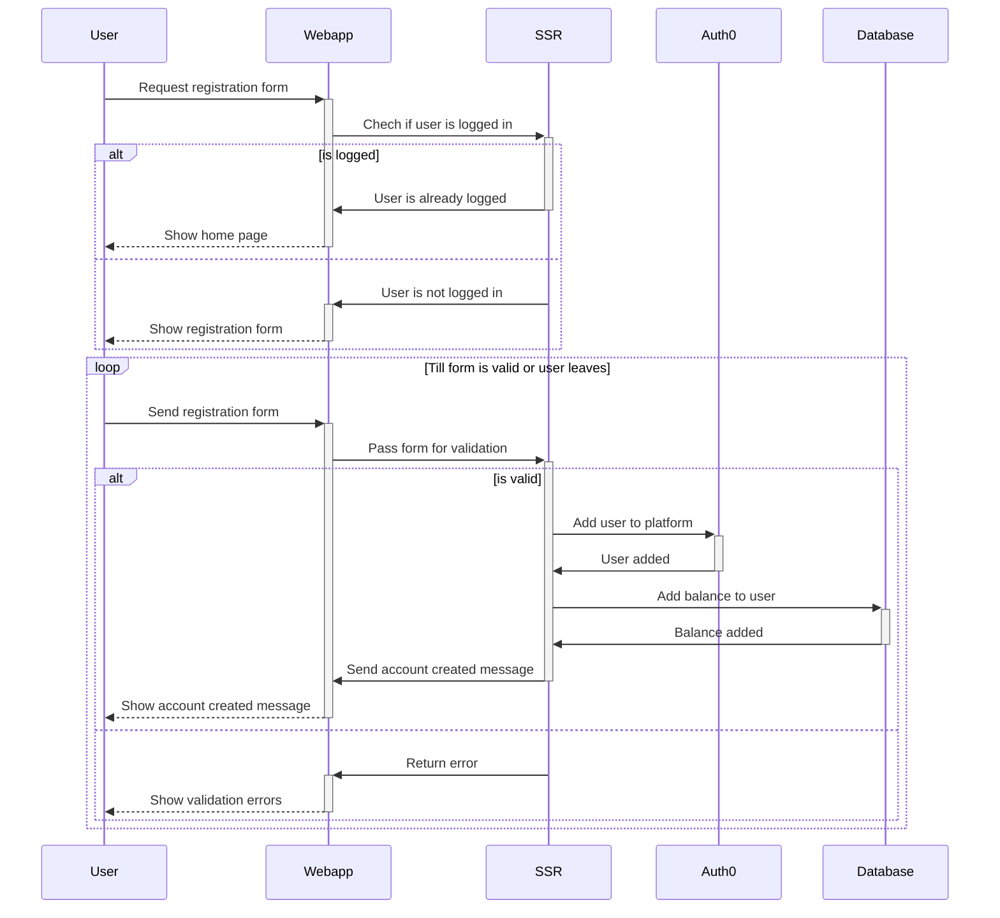
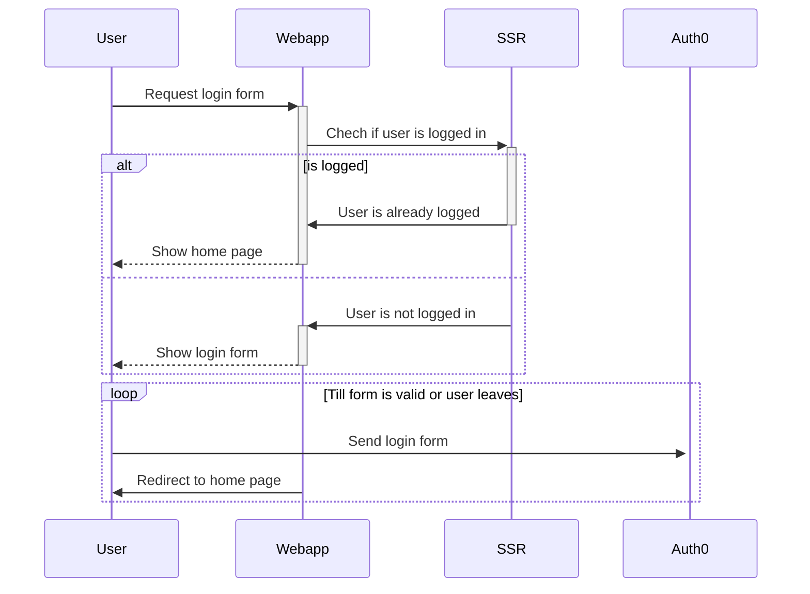

# Registration flow of user
Users will be kept in Auth0 platform. Additional information like balance will be in database.

```mermaid
sequenceDiagram
	User->>+Webapp: Request registration form
	Webapp->>+SSR: Chech if user is logged in
	alt is logged
		SSR->>-Webapp: User is already logged
		Webapp-->>-User: Show home page
	else
		SSR->>+Webapp: User is not logged in
		Webapp-->>-User: Show registration form
	end
	loop Till form is valid or user leaves
		User->>+Webapp: Send registration form
		Webapp->>+SSR: Pass form for validation
		alt is valid
			SSR->>+Auth0: Add user to platform
			Auth0->>-SSR: User added
			SSR->>+Database: Add balance to user
			Database->>-SSR: Balance added
			SSR->>-Webapp: Send account created message
			Webapp-->>-User: Show account created message
		else
			SSR->>+Webapp: Return error
			Webapp-->>-User: Show validation errors
		end
	end
```

# Login

```mermaid
sequenceDiagram
	User->>+Webapp: Request login form
	Webapp->>+SSR: Chech if user is logged in
	alt is logged
		SSR->>-Webapp: User is already logged
		Webapp-->>-User: Show home page
	else
		SSR->>+Webapp: User is not logged in
		Webapp-->>-User: Show login form
	end
	loop Till form is valid or user leaves
		User->>+Auth0: Send login form
		Webapp->>User: Redirect to home page
	end
```